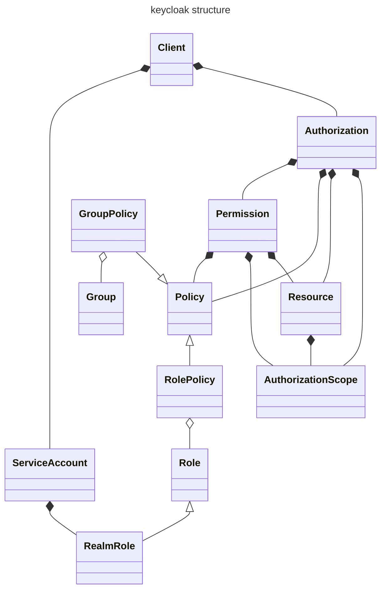
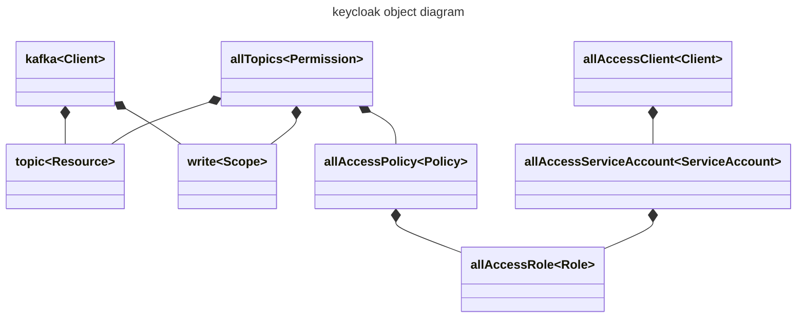

```mermaid
---
title: keycloak structure
---
classDiagram
Client *-- Authorization
Authorization *-- AuthorizationScope
Authorization *-- Resource
Authorization *-- Policy
Authorization *-- Permission

Resource *-- AuthorizationScope

Permission *-- Resource
Permission *-- AuthorizationScope
Permission *-- Policy


Client *-- ServiceAccount

ServiceAccount *-- RealmRole

Policy <|-- RolePolicy

Role <|-- RealmRole

GroupPolicy --|> Policy

GroupPolicy o-- Group
RolePolicy o-- Role

```

```mermaid
---
title: keycloak object diagram
---
classDiagram
kafka~Client~ *-- topic~Resource~
kafka~Client~ *-- write~Scope~

allTopics~Permission~ *--  topic~Resource~
allTopics~Permission~ *--  write~Scope~
allTopics~Permission~ *--  allAccessPolicy~Policy~

allAccessPolicy~Policy~ *-- allAccessRole~Role~

allAccessServiceAccount~ServiceAccount~ *-- allAccessRole~Role~

allAccessClient~Client~ *-- allAccessServiceAccount~ServiceAccount~

```
