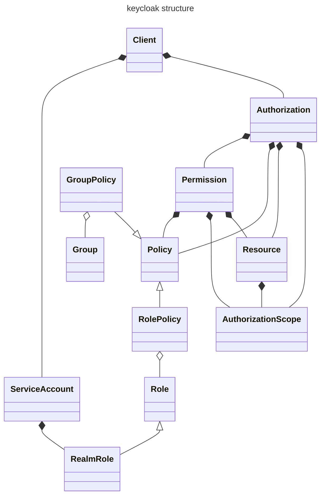
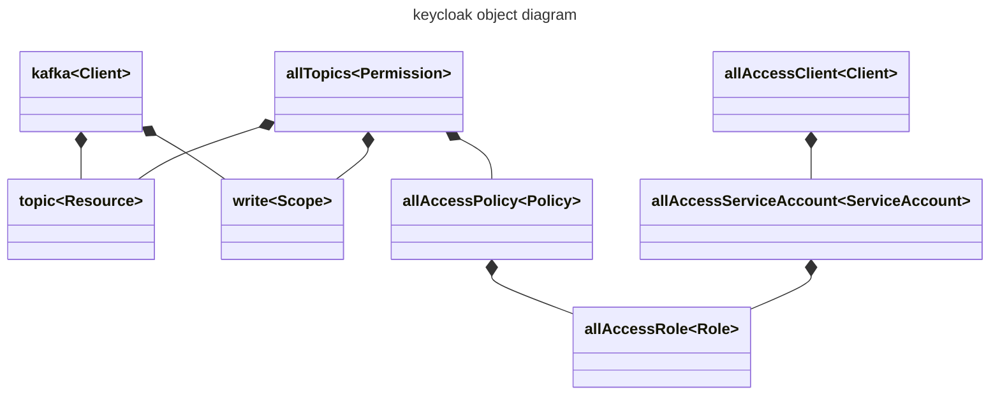

# keycloak and strimzi

Strimzi is set up in a compatible way to confluent - using a username and password.
Strimzi only supports username and password when used with oauth or keycloak.

To use this authorisation method you must use client service accounts, the secret on the service account is the password.

The client referenced in the strimzi config should have authorisation turned on and everything must be configured under the client authorisation section.

* `Resources` can be cluster, topic, group (kafka), transactionid
* `Scope` can be read, write, create, delete
* `Permission` combines the `Resource` and `Scope` - what you're allowed to do (Scope) to what (Resource)
* * `Permission` also links a `Policy` - `Role` or `Group` (Users) to this combined access pair
* Users can be in groups
* Clients/Service accounts can have Roles

We link the service account to a Role which then links to a Policy granting us actions (Scope) to Resources such as topics

